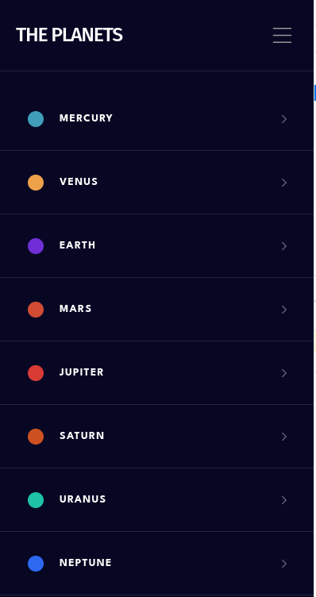

# Frontend Mentor - Planets fact site solution

## Welcome! 👋

This is a solution to the [Planets fact site challenge on Frontend Mentor](https://www.frontendmentor.io/challenges/planets-fact-site-gazqN8w_f). Frontend Mentor challenges help you improve your coding skills by building realistic projects. 

## Table of contents

- [Overview](#overview)
  - [The challenge](#the-challenge)
  - [Screenshot](#screenshot)
  - [Links](#links)
- [My process](#my-process)
  - [Built with](#built-with)
  - [What I learned](#what-i-learned)
- [Author](#author)

## Overview

Application where you can select the planet you want to learn about. You also can select among the planets to read about its general information, its internal structure or its surface geology. 

### The challenge

Users should be able to:

- View the optimal layout for the app depending on their device's screen size
- See hover states for all interactive elements on the page
- View each planet page and toggle between "Overview", "Internal Structure", and "Surface Geology"

### Screenshot

### Links

- Solution URL: [Add solution URL here](https://your-solution-url.com)
- Live Site URL: [Add live site URL here](https://your-live-site-url.com)

## My process

### Built with

- Semantic HTML5 markup
- CSS custom properties
- Flexbox
- Mobile-first workflow
- [Tailwind](https://tailwindcss.com/) - CSS framework
- [Angular](https://angular.dev/) - TS framework

### What I learned

It helped me deepen my knowledge of Angular 17 and Tailwind CSS and Angular Routing. 

## Author

- Frontend Mentor - [@laurymesa01](https://www.frontendmentor.io/profile/laurymesa01)
- Linkedin - [Laura Elena Mesa](https://www.linkedin.com/in/lauraelenamesa/)

